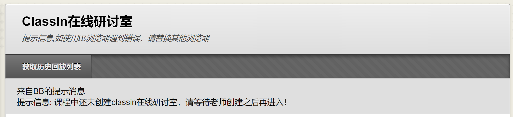
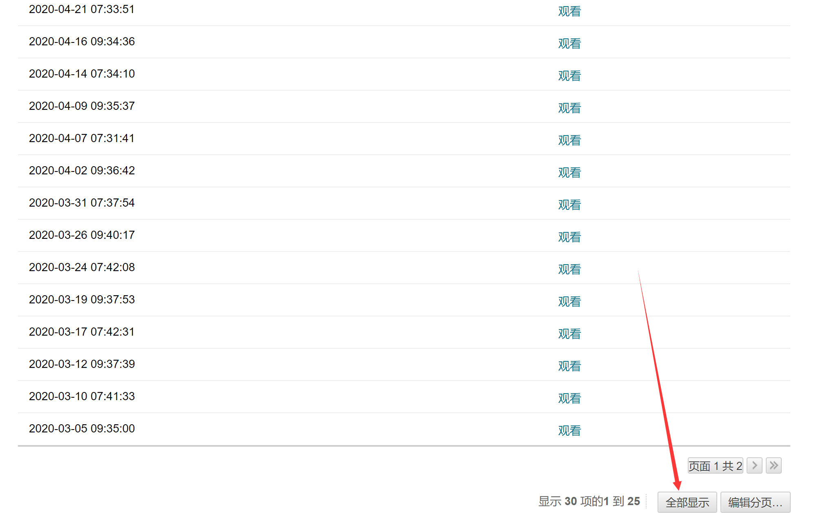
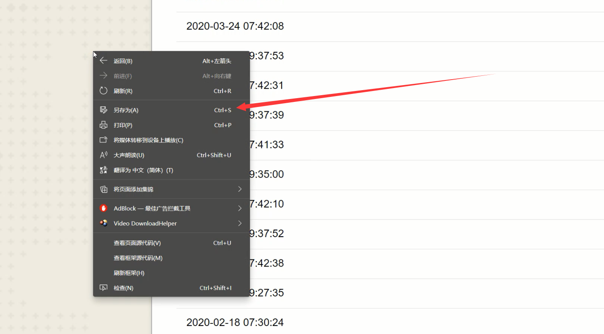
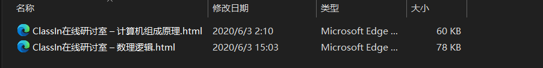

# ClassIn回放视频批量下载

为USTC学生下载BlackBoard上的课程视频开发。

## 使用方法

### 获取历史回放列表



### 全部显示



### 下载页面HTML



### 剪切`.html`文件到项目的`todo/`目录



### 运行`ClassInVideoDownload.py`开始下载

```bash
python ClassInVideoDownload.py
```

下载完成后，视频文件在`ClassInVideo/`中。